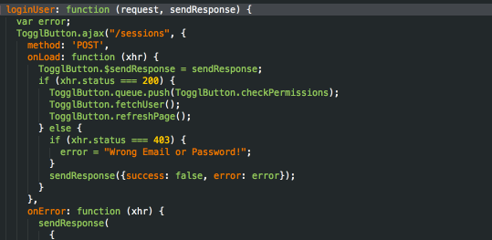

# SublimeLogMagic

Easily log JavaScript variables and parameters with keyboard shortcuts.


Now with CoffeeScript support!


## Installing

Simply look for "Log Magic" in Package Control.

## Usage

Simply press `cmd+alt+j` (`ctrl+alt+j`) to produce magic downwards or `cmd+alt+k` (`ctrl+alt+k`) to produce magic upwards.
When you're done press `cmd+alt+l` (`ctrl+alt+l`) to remove all magic.

You can also run these commands manually:
- `LogMagic Statement (down)`
- `LogMagic Statement (up)`
- `LogMagic Remove all`

## Features

### Log quickly

Any log statement is just a keyboard shortuct away


### Log anything

LogMagic inspects the current line and tries to extract interesting information from it:
- variable assignments
- function parameters in a function definition
- parameters in a function call
- supports ES6 destructuring
- supports ES6 optional parameters
- supports [flowtype](http://flowtype.org) (to some extent)
- ignores known values such as numbers, `true,` `false`, `null` and `undefined`
- falls back to printing `L<line number>` if it fails to parse anything meaningful

### Cycle through log types

Press the same keyboard shortcuts when already on a log statement to cycle through `log`,
`info`, `warn` and `error`.


### Up / Down support

You can add the log statement on the previous or the next line. This is especially helpful in case of return
statements.


Logging upwards can also change what's logged. Eg in the following case we're more interested in the
arguments passed to the callback than the variable assignment.


### ES6 destructuring support

LogMagic can parse destructuring and extract the necessary variable names from it (even
in case of renamed properties)


### Flowtype support

[Flowtype](http://flowtype.org) is cool. Best effort has been made to ignore flowtype's annotations and still produce a meaningful
log statement (but expect kinks and bugs here).


### Remove all log statements

With one command you can remove all log statements from the current file.



### CoffeeScript support

Logs stuff from coffeescript code. Even tries to understand function calls without parenthesis. Support for this is limited
but 90% of the time it should work all the time.

## Customizing

There are no customizable settings (feel free to make an issue).

You can override the custom keyboard shortcuts by adding this to your personal keyboard shortcuts file:

```json
[
    { "keys": ["super+alt+j"], "command": "log_magic_down", "context":
        [
            { "operand": "source.js", "operator": "equal", "match_all": true, "key": "selector" }
        ]
    },
    { "keys": ["super+alt+k"], "command": "log_magic_up", "context":
        [
            { "operand": "source.js", "operator": "equal", "match_all": true, "key": "selector" }
        ]
    },
    { "keys": ["super+alt+l"], "command": "log_magic_remove_all", "context":
        [
            { "operand": "source.js", "operator": "equal", "match_all": true, "key": "selector" }
        ]
    },
    { "keys": ["super+alt+j"], "command": "log_magic_down", "context":
        [
            { "operand": "source.coffee", "operator": "equal", "match_all": true, "key": "selector" }
        ]
    },
    { "keys": ["super+alt+k"], "command": "log_magic_up", "context":
        [
            { "operand": "source.coffee", "operator": "equal", "match_all": true, "key": "selector" }
        ]
    },
    { "keys": ["super+alt+l"], "command": "log_magic_remove_all", "context":
        [
            { "operand": "source.coffee", "operator": "equal", "match_all": true, "key": "selector" }
        ]
    }
]

```

## Contributing

Issues are welcome, especially if it spits out invalid javascript.

Btw this plugin should theoretically mostly work for most C-based languages (although by default
the keyboard shortcuts are only enabled for JavaScript and it spits out `console.*` statements).